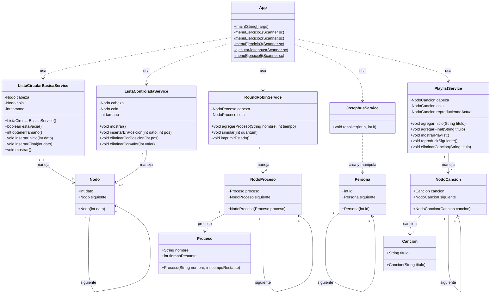

```mermaid
classDiagram

    %% CAPA MODELO
    class Nodo {
        +int dato
        +Nodo siguiente
        +Nodo(int dato)
    }

    class Proceso {
        +String nombre
        +int tiempoRestante
        +Proceso(String nombre, int tiempoRestante)
    }

    class NodoProceso {
        +Proceso proceso
        +NodoProceso siguiente
        +NodoProceso(Proceso proceso)
    }

    class Persona {
        +int id
        +Persona siguiente
        +Persona(int id)
    }

    class Cancion {
        +String titulo
        +Cancion(String titulo)
    }

    class NodoCancion {
        +Cancion cancion
        +NodoCancion siguiente
        +NodoCancion(Cancion cancion)
    }

    %% RELACIONES CAPA MODELO
    Nodo "1" --> "1" Nodo : siguiente
    NodoProceso "1" --> "1" Proceso : proceso
    NodoProceso "1" --> "1" NodoProceso : siguiente
    Persona "1" --> "1" Persona : siguiente
    NodoCancion "1" --> "1" Cancion : cancion
    NodoCancion "1" --> "1" NodoCancion : siguiente

    %% CAPA NEGOCIO
    class ListaCircularBasicaService {
        -Nodo cabeza
        -Nodo cola
        -int tamano
        +ListaCircularBasicaService()
        +boolean estaVacia()
        +int obtenerTamano()
        +void insertarInicio(int dato)
        +void insertarFinal(int dato)
        +void mostrar()
    }

    class ListaControladaService {
        -Nodo cabeza
        -Nodo cola
        -int tamano
        +void mostrar()
        +void insertarEnPosicion(int dato, int pos)
        +void eliminarPorPosicion(int pos)
        +void eliminarPorValor(int valor)
    }

    class RoundRobinService {
        -NodoProceso cabeza
        -NodoProceso cola
        +void agregarProceso(String nombre, int tiempo)
        +void simular(int quantum)
        -void imprimirEstado()
    }

    class JosephusService {
        +void resolver(int n, int k)
    }

    class PlaylistService {
        -NodoCancion cabeza
        -NodoCancion cola
        -NodoCancion reproduciendoActual
        +void agregarInicio(String titulo)
        +void agregarFinal(String titulo)
        +void mostrarPlaylist()
        +void reproducirSiguiente()
        +void eliminarCancion(String titulo)
    }

    %% RELACIONES MODELO - NEGOCIO
    ListaCircularBasicaService "1" --> "0..*" Nodo : maneja
    ListaControladaService "1" --> "0..*" Nodo : maneja
    RoundRobinService "1" --> "0..*" NodoProceso : maneja
    JosephusService ..> Persona : crea y manipula
    PlaylistService "1" --> "0..*" NodoCancion : maneja

    %% CAPA PRESENTACION / APP
    class App {
        +main(String[] args)$
        -menuEjercicio1(Scanner sc)$
        -menuEjercicio2(Scanner sc)$
        -menuEjercicio3(Scanner sc)$
        -ejecutarJosephus(Scanner sc)$
        -menuEjercicio5(Scanner sc)$
    }

    %% RELACIONES NEGOCIO - APP
    App ..> ListaCircularBasicaService : usa
    App ..> ListaControladaService : usa
    App ..> RoundRobinService : usa
    App ..> JosephusService : usa
    App ..> PlaylistService : usa
```
